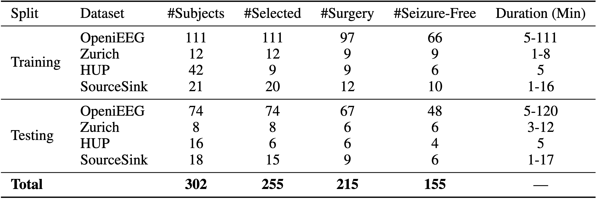
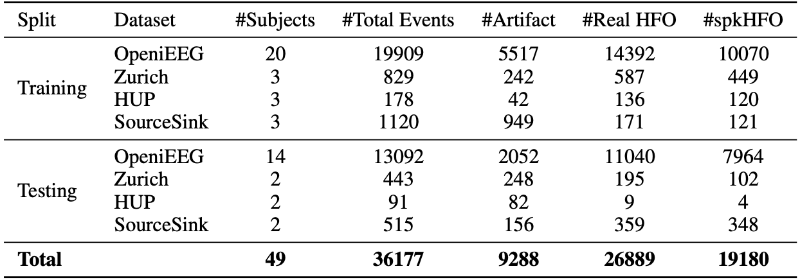
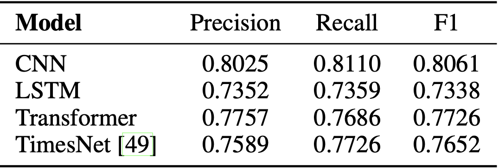
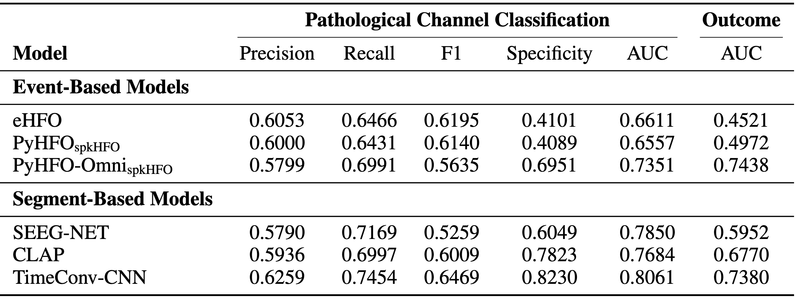
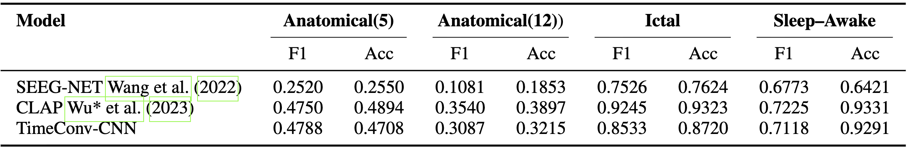

  

  <ul style="list-style-type: none; padding-left: 0;">
    <strong>TL;DR: </strong> 
    Omni-iEEG is the first <strong>large-scale, harmonized intracranial EEG dataset</strong>, 
    comprising <strong>302 patients, 178 hours of recordings, and 36K expert annotations</strong>. 
    It establishes <strong>clinically meaningful and unified benchmarks</strong> with standardized evaluation 
    metrics to bridge <strong>clinical neuroscience</strong> and <strong>machine learning</strong>.
  </ul>

  <h3 style="text-align: center">Dataset Overview</h3>
  

    
  

  

    Omni-iEEG integrates recordings from eight epilepsy centers with harmonized clinical metadata 
    (SOZ, resection regions, surgical outcomes, anatomical labels). Data will be released in 
    <strong>BIDS format</strong> with an accompanying utility library on Github. We will also released the data in hugginface for easier access.
  

  <h3 style="text-align: center">Event Annotation</h3>
  

    
  

  

    Over <strong>36,000 high-frequency oscillation (HFO) events</strong> were annotated, combining 
    new and previously published events. Candidate events were detected with three established 
    algorithms (STE, MNI, Hilbert) and reviewed by <strong>four board-certified epileptologists</strong>. 
    Each event was labeled as <em>artifact</em>, <em>non-spkHFO</em>, or <em>spkHFO</em>.
  

  

    To ensure quality, annotators first calibrated on a shared set, then labeled independently. 
    Inter-rater agreement was high (<strong>Fleiss’ κ = 0.93</strong>), reflecting strong consistency 
    and clinical reliability. All signals were resampled to 1 kHz and standardized with bipolar montage 
    where appropriate.
  

  <h3 style="text-align: center">Benchmark Tasks</h3>
  

    <strong>Task 1:</strong> Clinical prior-driven pathological event classification (spkHFO vs non-spkHFO vs artifact). 
    <strong>Task 2:</strong> Pathological brain region identification (SOZ vs normal channels, outcome prediction). 
    <strong>Exploratory Tasks:</strong> Anatomical location classification, Ictal period identification, Sleep–Awake classification.
  

  <h3 style="text-align: center">Task 1:Pathological Event Classification</h3>
  

    
  

  

    We benchmark recent competitive baseline event classification methods. PyHFO method trained on Omni-iEEG achieves the highest F1 (~0.81), 
    demonstrating strong performance on spkHFO detection.
  

  <h3 style="text-align: center">Pathological Brain Region Identification</h3>
  

    
  

  

    Both event-based and segment-based models are evaluated. Segment models (TimeConv-CNN, CLAP, SEEG-Net) 
    achieve up to <strong>0.81 AUC</strong> in pathological channel identification and correlate well with 
    surgical outcome prediction.
  

  <h3 style="text-align: center">Exploratory Tasks</h3>
  

    
  

  

    Three exploratory tasks extend Omni-iEEG:
  

  <ul>
    <li><strong>Anatomical Location Identification:</strong> 5-class lobes and 12-class subregions.</li>
    <li><strong>Ictal Period Classification:</strong> detect ictal vs interictal periods.</li>
    <li><strong>Sleep–Awake Classification:</strong> identify vigilance states in invasive recordings.</li>
  </ul>
  

    Pretrained audio models (<strong>CLAP</strong>) perform strongly (e.g., 
    <em>F1 = 0.92, Acc = 0.93</em> on ictal classification), while CNNs remain competitive.
  

  <h3 style="text-align: center">Conclusion</h3>
  

    Omni-iEEG provides a unified, clinically validated foundation for data-driven epilepsy research. 
    It enables systematic benchmarking, improves reproducibility, and opens new research directions 
    at the intersection of <strong>clinical neurophysiology</strong> and <strong>AI</strong>.
  

  <h3 style="text-align: center">Reference</h3>
<pre><code>@inproceedings{duan2026omniieeg,
  title={Omni-iEEG: A Large-Scale, Comprehensive iEEG Dataset and Benchmark for Epilepsy Research},
  author={Duan, Chenda and Zhang, Yipeng and Kanai, Sotaro and Ding, Yuanyi and Daida, Atsuro and Yu, Pengyue and Zheng, Tiancheng and Kuroda, Naoto and Hussain, Shaun A. and Asano, Eishi and Nariai, Hiroki and Roychowdhury, Vwani},
  booktitle = {International Conference on Learning Representations (ICLR)},
  year      = {2026}
}
</code></pre>

